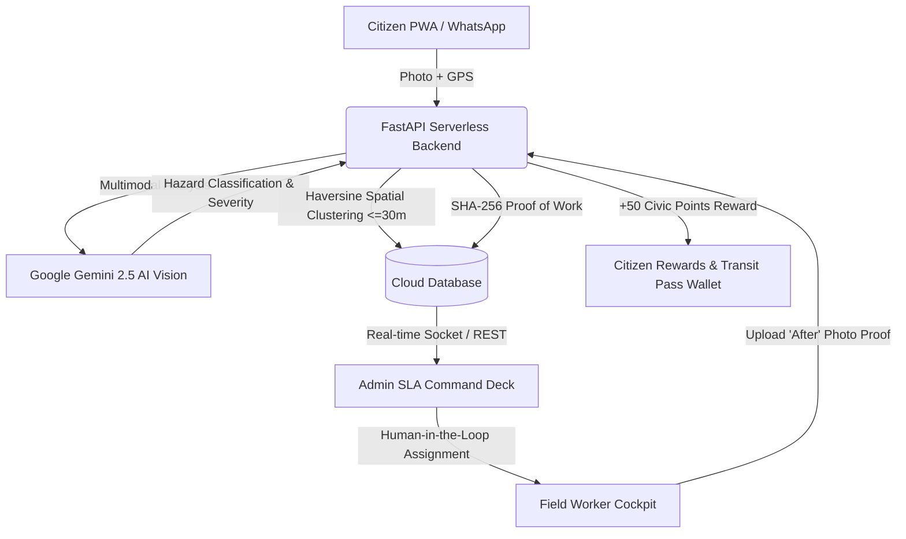

# 🌿 Gantavya (गंतव्य) — Smart City Civic Governance & Mobility Platform

[](https://gantavya-portal.vercel.app)
[](https://gantavya-portal.vercel.app)
[](https://fastapi.tiangolo.com/)
[](https://react.dev/)
[](https://ai.google.dev/)
[](LICENSE)

> **"Live Peacefully. Shape Your City."**  
> Gantavya (गंतव्य) is a unified next-generation Smart City Civic Governance and Citizen Mobility Platform. It bridges the critical divide between citizen complaint reporting and municipal ground action through real-time AI vision verification, dynamic geospatial duplicate clustering, Human-in-the-Loop (HITL) SLA-driven dispatch, and an integrated civic rewards gamification economy.

---

## 🌐 Live Production Access & Demo Credentials

**Live Portal:** 🔗 [https://gantavya-portal.vercel.app](https://gantavya-portal.vercel.app)

You can explore all three core user workflows immediately using the **1-Tap Demo Pills** on the login page:

| Role | Demo Email | Demo Password | Key Features & Access |
| :--- | :--- | :--- | :--- |
| 🧑‍💼 **Citizen** | `citizen1@civicpulse.demo` | `Citizen@123` | **50,000 PTS (Diamond Reformer)**, AI Vision Report Submission, Scannable Transit Pass Wallet, Civic Honor Certificate, 8-Language Voice Assistant, Offline PWA |
| 🛡️ **Admin** | `admin@civicpulse.demo` | `Admin@123` | Executive SLA Dashboard, Live GIS Incident Heatmap, Municipal Department Filter, Smart Workload-Balanced Worker Dispatch |
| 👷 **Field Worker** | `worker1@civicpulse.demo` | `Worker@123` | Real-time Assigned Route & GPS Navigation, Turn-by-Turn Work Orders, "After" Photo Resolution Proof Upload with Cryptographic Hash |

---

## 🚀 Key Architectural Innovations



### 1. 🧠 Multimodal AI Vision Verification (Google Gemini 2.5 Flash)
- Automatically inspects user-uploaded photos to classify civic issues (Potholes, Sanitation Dump, Broken Streetlights, Water Leaks).
- Assigns severity scores (0.0 – 10.0) and filters out invalid or synthetic media before municipal triage.

### 2. 📍 Dynamic Geospatial Duplicate Clustering (30m Buffer)
- When multiple citizens report the same physical pothole or waste dump, Gantavya uses spatial proximity and category matching to merge reports under a single work order.
- Prevents redundant municipal assignments while aggregating citizen upvotes and increasing resolution priority.

### 3. 🛡️ Cryptographic Proof of Work (PoW) & Anti-Fraud Verification
- Field workers cannot close an issue with a single tap; they must upload an authentic "After" repair photo.
- The system generates an immutable SHA-256 verification hash and allows citizens to verify the fix on the ground.

### 4. 🎁 Civic Rewards & Sustainable Public Transit Economy
- Citizens earn verified **Civic Points** for reporting issues and confirming resolutions.
- Points can be redeemed for **Free Metro Rail Passes**, **Electric Bus Tickets**, and **Municipal Rebates** with scannable dynamic barcodes.

### 5. 🎙️ Multi-Lingual Voice AI Assistant (8 Regional Languages)
- Real-time voice assistance supporting **Hindi, English, Marathi, Bengali, Tamil, Telugu, Gujarati, and Kannada**.
- Empowers all citizen demographics to report civic hazards hands-free.

### 6. 📶 Offline PWA Radar & Background Sync
- Fully installable Progressive Web App (PWA) with Service Worker caching.
- Citizens can capture photos in low-connectivity zones; reports automatically synchronize when network is restored.

---

## 🛠️ Technology Stack

| Layer | Technologies Used |
| :--- | :--- |
| **Frontend UI** | React 19, TypeScript, Vite, Tailwind CSS, Lucide Icons, Canvas Confetti, Leaflet / React-Leaflet |
| **Backend API** | FastAPI (Python 3.12), SQLAlchemy ORM, Pydantic v2, Uvicorn |
| **AI / Machine Learning** | Google Gemini 2.5 Flash API (Multimodal Vision & NLP Reasoning) |
| **Database & Storage** | PostgreSQL / Resilient Serverless SQLite engine |
| **Deployment & DevOps** | Vercel Serverless Production Deployment, GitHub Actions CI/CD |
| **PWA & Mobile** | Web Manifest, Service Worker, Responsive Touch UI for Android & iOS |

---

## 💻 Local Development Setup

### 1. Clone Repository
```bash
git clone https://github.com/anand44124/gantavya-smart-city.git
cd gantavya-smart-city
```

### 2. Backend Setup
```bash
cd backend
python -m venv .venv
source .venv/bin/activate   # On Windows: .venv\Scripts\activate
pip install -r requirements.txt
uvicorn main:app --reload --port 8000
```
*Backend API will run at `http://127.0.0.1:8000` (Swagger docs: `/docs`).*

### 3. Frontend Setup
```bash
cd frontend
npm install
npm run dev
```
*Frontend will run at `http://localhost:5173`.*

---

## 📁 Repository Structure

```
gantavya-smart-city/
├── api/                        # Vercel Serverless Functions & Routes
│   ├── api/routes/             # Auth, Issues, Reports, Rewards, Workers, Webhooks
│   ├── services/               # Gemini AI Vision, SLA Engine, Rewards
│   ├── db.py                   # Resilient Database Connection
│   └── index.py                # Serverless FastAPI Entrypoint
├── backend/                    # Standalone Local Backend Server
├── frontend/                   # React 19 + Vite Frontend
│   ├── src/
│   │   ├── components/         # Modals, Dashboards, Map Radars, Certificate Engine
│   │   ├── i18n/               # 8-Language Localization (Hindi, Marathi, etc.)
│   │   ├── App.tsx             # Routing & Global State
│   │   └── App.css             # Glassmorphism & Fluid Styling
│   └── public/                 # PWA Manifest, Official Logos, Seals
├── SIH_TEAM_PITCH_KIT.md       # Complete Team Pitch & Judge Q&A Guide
├── HANDOFF.md                  # System Architecture Handoff Document
└── LICENSE                     # MIT Open Source License
```

---

## 👥 Smart India Hackathon (SIH 2026) Submission

- **Track:** Smart Cities & Civic Governance
- **Platform Name:** Gantavya (गंतव्य)
- **Official Portal:** [https://gantavya-portal.vercel.app](https://gantavya-portal.vercel.app)
